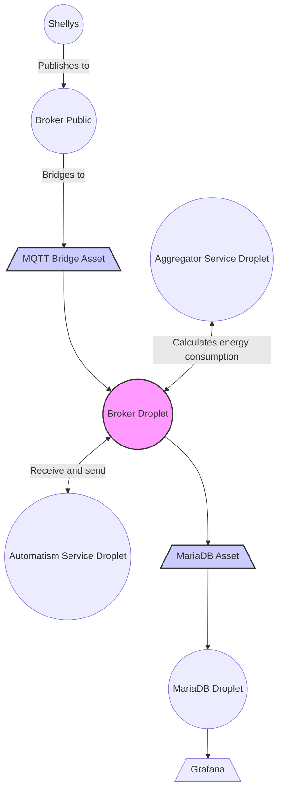
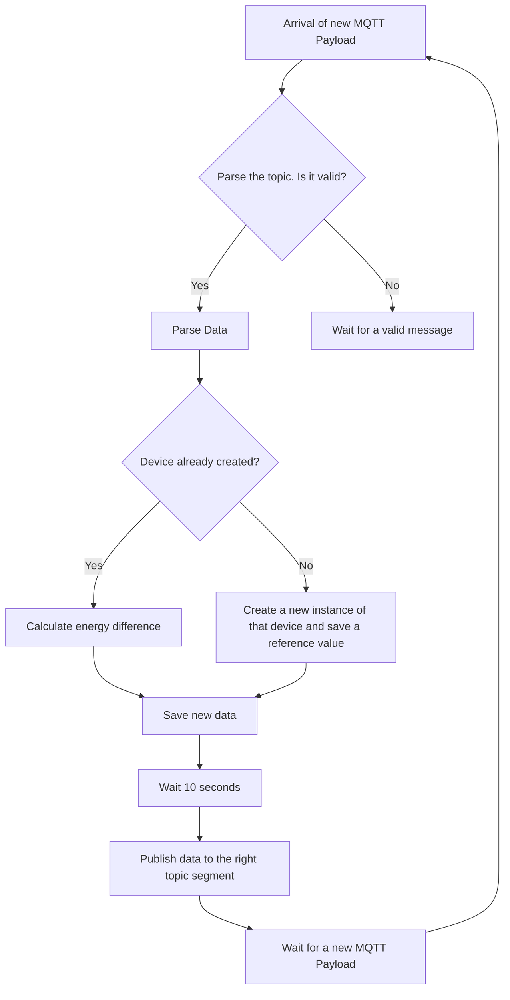

# Coreflux - Energy Monitoring System

## Overview

This project is an Energy Consumption Monitoring System that aggregates and reports energy usage data from various devices within a company. The system is built using C# and relies on MQTT for communication. It processes energy data from **Shelly devices** and provides aggregated results at the device, room, office, and company levels.

## Features

- **Real-Time Data Collection:** Collects energy consumption data from Shelly devices in real-time using Coreflux MQTT.
 
- **Hierarchical Aggregation:** Aggregates energy data at different levels: devices, rooms, offices, and the entire company.

- **Configurable and Automatic Topic Subscription:** Uses a TOML configuration file to set up initial MQTT topics. Automatically subscribes to MQTT topics for new devices, rooms, and offices as they are discovered.

- **Detailed Logging:** Logs detailed information about energy consumption for each device, room, office, and the entire company in order to ensure that everything is being sent to the right locations.

## Project WorkFlow



## Getting Started

### Prerequisites
- .NET SDK 8.0
- Shelly devices properly configured and connected to the MQTT broker
- [Coreflux MQTT broker](https://coreflux.org/)

### Installation

1. Clone the repository:
```bash
git clone git@github.com:CorefluxCommunity/Coreflux-Energy_Monitoring_System.git
cd Coreflux-Energy_Monitoring_System
```
2. Build the project:
```bash
dotnet build
```
3. Run the project
```bash
dotnet run
```
### Configuration

The system is configured using a TOML file named **config.toml**. This file should contain the MQTT topic information for the company's energy data. Below is an example configuration:

```toml
[company]
topic = "Coreflux/#"
```
## Project Structure

- **Worker:** The core service that runs continuously, processing incoming MQTT messages and updating energy consumption data.

- **Company, Office, Room, Device:** Classes representing the hierarchy of the organization, each segment with its own energy consumption data.

- **DeviceDetails:** Class representing the detailed energy data reported by each Shelly device.

### Data Processing

- **Device Level:** Each device reports its energy data, which is processed and stored.

- **Room Level:** The energy data from all devices in a room is aggregated to provide room-level consumption.

- **Office Level:** The energy data from all rooms in an office is aggregated to provide office-level consumption.

- **Company Level:** The energy data from all offices is aggregated to provide company-level consumption.

### Usage

The system will automatically subscribe to the MQTT topics specified in the configuration file and start collecting energy data from Shelly devices. The collected data will be aggregated and logged at regular intervals.

Using MQTT Explorer will help visualise the publication of each message, showing the energy spent on each topic segment.

### Data Flow Diagram


